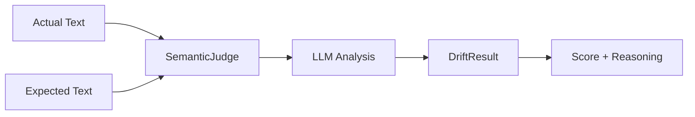

# Core Concepts

Understanding the fundamental concepts behind SemanticTest.

## The Problem with Traditional Testing

When testing AI systems, traditional assertions fail:

```python
# Your AI chatbot
response = chatbot.ask("What's 2+2?")

# Traditional test - FAILS on any paraphrasing
assert response == "The answer is 4"

# What if AI responds with:
# - "4"
# - "The result is 4"
# - "2+2 equals 4"
# - "That would be four"
# All correct, but all fail the test!
```

## Semantic Evaluation

SemanticTest solves this by evaluating **meaning**, not **syntax**:

```python
from semantictest import SemanticJudge

judge = SemanticJudge()

result = judge.evaluate(
    actual="The result is 4",
    expected="The answer is 4"
)

print(result.score)  # 0.95 - High semantic similarity!
```

### How It Works



1. **Input**: Two texts - `actual` (AI output) and `expected` (ground truth)
2. **Analysis**: The judge uses an LLM to compare semantic meaning
3. **Output**: A `DriftResult` with a similarity score and reasoning

## The DriftResult

Every evaluation returns a `DriftResult`:

```python
result = judge.evaluate(actual, expected)

print(result.score)      # float: 0.0 to 1.0
print(result.reasoning)  # str: Explanation of the evaluation
print(result.actual)     # str: The actual text
print(result.expected)   # str: The expected text
```

### Score Interpretation

| Score | Meaning | Action |
|-------|---------|--------|
| **0.9 - 1.0** | Perfect alignment | ✅ Test passes |
| **0.8 - 0.9** | High alignment | ✅ Usually acceptable |
| **0.5 - 0.7** | Moderate alignment | ⚠️ Review needed |
| **0.3 - 0.4** | Low alignment | ❌ Likely failure |
| **0.0 - 0.2** | Minimal alignment | ❌ Complete mismatch |

### Choosing a Threshold

The threshold depends on your use case:

```python
# Strict (factual accuracy required)
assert result.score > 0.9

# Standard (semantic correctness)
assert result.score > 0.8

# Lenient (general topic match)
assert result.score > 0.7
```

## Semantic Drift

**Semantic drift** occurs when AI outputs gradually deviate from expected behavior:

```python
# Day 1: AI response
"Our return policy is 30 days"  # Score: 1.0

# Day 30: AI starts drifting
"We usually accept returns around 30 days"  # Score: 0.85

# Day 60: Significant drift
"Returns are handled on a case-by-case basis"  # Score: 0.4 ❌
```

SemanticTest helps you catch this drift before it reaches users.

## Deterministic Evaluation

For reliable CI/CD, evaluations should be **deterministic**:

```python
# Same inputs → Same outputs
judge = SemanticJudge(temperature=0.0)  # Key setting!

result1 = judge.evaluate("The sky is blue", "The sky has a blue color")
result2 = judge.evaluate("The sky is blue", "The sky has a blue color")

assert result1.score == result2.score  # ✅ Reproducible
```

!!! warning "Always use temperature=0 in CI/CD"
    Non-zero temperatures introduce randomness, causing flaky tests.

## Factual vs. Stylistic Differences

The judge distinguishes between:

### Stylistic Differences (High Score)

Both texts convey the same facts, just worded differently:

```python
result = judge.evaluate(
    actual="Revenue grew by 15% this quarter",
    expected="This quarter saw 15% revenue growth"
)
# Score: 0.95+ (same facts, different style)
```

### Factual Differences (Low Score)

Texts contain different information:

```python
result = judge.evaluate(
    actual="Revenue grew by 15% this quarter",
    expected="Revenue declined by 5% this quarter"
)
# Score: 0.2 or lower (contradictory facts)
```

## Batch Evaluation

For testing multiple cases efficiently:

```python
test_cases = [
    {"actual": "Response 1", "expected": "Expected 1"},
    {"actual": "Response 2", "expected": "Expected 2"},
    {"actual": "Response 3", "expected": "Expected 3"},
]

results = judge.batch_evaluate(test_cases)

for result in results:
    print(f"Score: {result.score}")
```

## The System Prompt

Under the hood, `SemanticJudge` uses a carefully designed system prompt:

```python
# The judge is instructed to:
# 1. Be deterministic (same inputs → same outputs)
# 2. Focus on factual meaning, not style
# 3. Distinguish between drift and paraphrasing
# 4. Provide clear reasoning
```

This prompt is optimized through extensive testing to provide reliable, consistent evaluations.

## Use Cases

### 1. Unit Testing AI

```python
def test_ai_math():
    response = ai.calculate("2 + 2")
    result = judge.evaluate(response, "The answer is 4")
    assert result.score > 0.8
```

### 2. Regression Testing

```python
def test_no_regression():
    baseline = load_baseline_responses()
    current = get_current_responses()

    for base, curr in zip(baseline, current):
        result = judge.evaluate(curr, base)
        assert result.score > 0.9, "Regression detected!"
```

### 3. Production Monitoring

```python
def monitor_production():
    for response in production_stream:
        result = judge.evaluate(response, expected_behavior)
        if result.score < 0.7:
            alert_oncall(f"Drift detected: {result.reasoning}")
```

### 4. A/B Testing

```python
def compare_models():
    for prompt in test_prompts:
        response_a = model_a.generate(prompt)
        response_b = model_b.generate(prompt)

        result = judge.evaluate(response_a, response_b)
        log_comparison(prompt, result)
```

## Next Steps

- [LLM Providers](providers.md) - Configure different AI providers
- [Testing Integration](testing.md) - Use with pytest and CI/CD
- [Best Practices](best-practices.md) - Tips for effective testing
